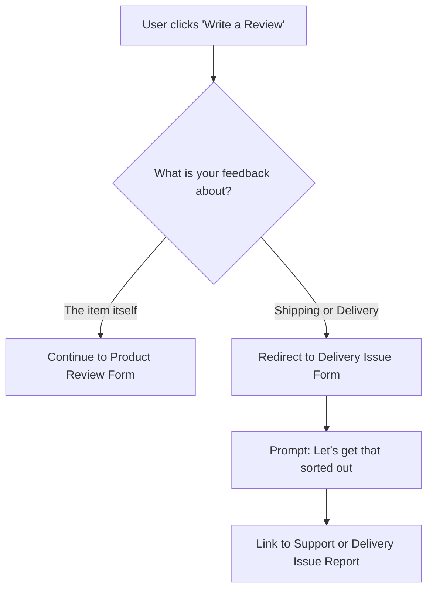

> **Disclaimer:**  
This article is an independent analysis created for educational and portfolio purposes. I am not affiliated with Walmart, and the views expressed here are my own. 
>
This content is not sponsored, endorsed, or reviewed by Walmart. Any product names, brand names, or trademarks mentioned are the property of their respective owners. 
>
My goal is to highlight a common user experience issue and suggest a possible profitable solution - not to criticize or misrepresent Walmart or its partners.

In ecommerce, clarity isn’t optional. It’s essential.

On Walmart.com, many top products have low ratings. It's not because the products are bad, but because frustrated customers mix product complaints with shipping issues in their reviews. This blurs the true quality of the products, hurts customer trust, and hides real problems.

---

This case study shows a key UX problem causing this and offers a simple content solution: a **review clarification prompt** that helps separate delivery complaints from product reviews. The outcome? More accurate ratings, higher buyer confidence, and a fairer playing field for top-selling items.

---
## The Problem: Product Ratings Penalized for Shipping Issues
> 75% of sampled 1-star reviews for Angel Soft toilet paper were about shipping, not the product.

Walmart.com sells items directly and through third-party sellers. This mix expands choices but causes varied delivery experiences.

The review system doesn’t separate product feedback from shipping complaints. 

**Here’s the issue:**

- A customer receives an item late or damaged
    
- They leave a 1-star review
    
- The product rating drops even though the problem wasn’t the product itself
    

**This causes:**

- Unfairly lowered product ratings
    
- Misleading averages that hide real insights
    
- Lost sales and eroded trust in Walmart and its sellers

---
## How Big Is the Problem?

Looking at Walmart’s best sellers, many 1-star reviews actually complain about shipping, not the product.

**Most Reviewed Products Within Some of Walmart’s Top-Selling Categories (Sampling 20 Most Recent Reviews Per Product)**
*(Sources: [Expert Beacon](https://expertbeacon.com/11-most-sold-items-at-walmart/), [Marketing Scoop](https://www.marketingscoop.com/consumer/11-most-sold-items-at-walmaWalmart))*

| Item                                                                                                                                                                               | Category               | Total Ratings | 1-Star Reviews About Shipping (out of 20 sampled)  |
| ---------------------------------------------------------------------------------------------------------------------------------------------------------------------------------- | ---------------------- | ------------- | ----------------------------------------------------- |
| [Angel Soft Toilet Paper](https://www.walmart.com/ip/Angel-Soft-2-Ply-Toilet-Paper-9-Mega-Rolls/708542578?classType=VARIANT&athbdg=L1100&from=/search)                             | Toilet Paper           | 81.7K         | 15 (75%)                                              |
| [7-Quart Slow Cooker](https://www.walmart.com/ip/Crock-Pot-Manual-7-Quart-Slow-Cooker-Black/40703590)                                                                              | Slow Cookers           | 9509          | 9 (45%)                                               |
| [32”(720P) LED Smart Television](https://www.walmart.com/ip/onn-32-Class-HD-720P-LED-Roku-Smart-Television-100012589/314022535?classType=REGULAR&from=/search)                     | Televisions            | 54.9K         | 9 (45%)                                               |
| [Equate Flushable Wet Wipes](https://www.walmart.com/ip/Equate-Flushable-Wipes-Fresh-Scent-5-packs-of-48-wipes-240-Total-Wipes/873764?classType=VARIANT&athbdg=L1100&from=/search) | Flushable Wipes        | 54.4K         | 13 (65%)                                              |
| [Sparkle Paper Towels](https://www.walmart.com/ip/Sparkle-Tear-a-Square-Paper-Towels-6-Double-Rolls/656274757?classType=REGULAR&athbdg=L1100&from=/search)                         | Paper Towels           | 37.8K         | 11 (55%)                                              |
| [Mainstays Bed Pillow](https://www.walmart.com/ip/Mainstays-Comfort-Complete-Bed-Pillow-Standard-Queen/744932389?classType=VARIANT&athbdg=L1200&from=/search)                      | Pillows                | 26.4K         | 2 (10%)                                               |
| [TAL Stainless Steel Water Bottle](https://www.walmart.com/ip/TAL-Stainless-Steel-Ranger-Water-Bottle-with-Easy-Sip-Straw-26oz-Black/986184222?classType=VARIANT&from=/search)     | Reusable Water Bottles | 5,442         | 5 (25%)                                               |
*Each product’s 1-star review column reflects a manual examination of 20 of the most recent one-star reviews.*

---
## What Customers Are Saying (That Shouldn’t Hurt Product Ratings)

These are just a few examples from a single product's one-star reviews.

---

> “I paid for the 3 Hours or Less for $5.00 and I didn't get credit for the $5.00 according to my order which I should have. 5 of my items that I have been trying to get from Walmart for the last 3 deliveries are always out of stock. My order was 45 minutes late being delivered. I have not been happy with Walmart for a couple of months now. Thinking of switching to Amazon or Target.”  
![[Pasted image 20250523113120.png]]

---

> "It has been 48 hours since I ordered my groceries. I am still sitting here. I do not know what the problem is and no one has contacted me so I don't know. I just give him one star for this one."
> 
![[Pasted image 20250523112932.png]]

---

> “The order stated it was here at 3:35 and it's still not here 10 minutes later. so your drivers are stating that the deliveries are delivered when they're not. just a fti. iv been outside for over 15 min thinking it was here, but its not.”
>  
![[Pasted image 20250523112912.png]]

---

> “I am insulted you would even send this. I never received the order or my refund for the order after 2 weeks. Send my refund and you won't have to worry about me ordering anything else from Walmart nor bothering me. Thank you.”
![[Pasted image 20250523112754.png]]

These are real issues, but they reflect shipping, not product quality.

---
## Why This Matters to Walmart’s Revenue

Assuming only 5% of unhappy customers leave reviews, 750 shipping-related 1-star reviews for one product mean about 15,000 affected shoppers.

If 10% of those reduce their Walmart shopping by 10% annually (assuming $1,000 spend), Walmart could lose roughly $150,000 a year from just that one product.

Fixing this can recapture revenue and improve customer loyalty.

---

## Current Review Flow
At the time of writing, this is the current logic flow for a product review. 

### Step 1
![[msedge_ztWlDjpFp3.png]]
**Above:** Upon clicking review, the star rating is displayed first, assuming the customer will review about the product only. 
### Step 2
![[YfiJNUuw2g.png]]
**Above:** The review form proceeds to the second step allowing the user to enter more details.
## Proposed Solution: Add a Review Clarification Prompt

Introduce a simple UX step when customers start a review:
### Step 1: Ask What the Review Is About

**“What would you like to share feedback about?”**

- The item itself
    
- My shipping or delivery experience

### Step 2: Route Accordingly

- If **shipping or delivery** is chosen:  
	- Show a message:  _“We're sorry to hear that. Delivery issues are best handled by Customer Care. Let’s get that sorted.”_  
	- Link to “Report a Delivery Issue” or live chat.
- If **the item itself** is chosen:  
	- Proceed with the standard product review form.

### Review Submission Flowchart

---

### Additional Review Logic: Smart Keyword Detection

To further reduce misdirected negative reviews, keyword detection can be integrated into the product review submission process. 

This logic scans user input in real time to identify language that suggests the issue lies outside of the product itself (such as shipping delays, fulfillment errors, or customer service problems.) 

If detected, the system can gently redirect the user with a message like, “It looks like you may be experiencing a service-related issue. Would you like help resolving it instead of leaving a product review?”

This proactive approach doesn’t rely on the user carefully reading the prompt. Instead, it uses a dynamic keyword detection list to identify common phrases tied to service-related frustrations. Below are sample keyword groupings that can trigger rerouting:

| **Category**                | **Example Keywords/Phrases**                                                                  |
| --------------------------- | --------------------------------------------------------------------------------------------- |
| **Delivery Issues**         | late delivery, delayed, not delivered, delivery date missed, still waiting                    |
| **Order Fulfillment**       | out of stock, items missing, subscription issues, wrong items, unwanted items, didn’t receive |
| **Customer Service**        | no update, couldn’t get help, contacted customer service, no resolution, poor communication   |
| **Refund/Billing Problems** | didn’t get credit, charged for undelivered items, canceled but still charged                  |
| **Brand Switching Threats** | thinking of switching to Amazon, thinking of switching to Target                              |
By surfacing appropriate support channels at the right time, this logic preserves the integrity of product reviews while improving customer experience.

### Smart Keyword Detection Example

![[879w default (1).jpg]]
**Above:** This example shows how the smart keyword detection UX copy could appear.

---

## Why This Works

- Keeps product ratings accurate by filtering out delivery complaints
    
- Protects seller reputations from unfair penalties
    
- Builds customer trust by guiding them to the right support
    
- Matches best practices used by Amazon, Etsy, and other major ecommerce sites

---

## Next Steps for Walmart Stakeholders

To validate and scale this solution, consider the following action plan:

### 1. Pilot Test the Clarification Prompt

- **Target**: Select 3-5 high-traffic product categories with a high volume of shipping-related 1-star reviews.
    
- **Goal**: Test whether the clarification prompt reduces off-topic reviews and improves rating accuracy.
    
- **KPIs to Track**:
    
    - % reduction in shipping-related language in product reviews
        
    - % change in average product rating
        
    - % increase in resolved delivery issues via support channels
        

### 2. Monitor Business Impact

- **Sales Metrics**: Track conversion rates before and after the prompt is introduced.
    
- **Customer Satisfaction (CSAT/NPS)**: Survey users who leave reviews to measure perceived ease and fairness of the process.
    
- **Support Volume**: Measure changes in delivery issue reporting via Customer Care.
    

### 3. Gather Qualitative Feedback

- **Internal**: Survey frontline Customer Service teams and Marketplace sellers for input on post-implementation clarity.
    
- **External**: Monitor review content for tone, helpfulness, and relevance post-implementation.
    

### 4. Iterate Based on Insights

- Refine copy based on customer behavior and feedback.
    
- Adjust UX flow if friction or confusion is observed during the pilot.
    

### 5. Scale Across Platform

- Roll out to additional categories.
    
- Integrate with Walmart's app and web platforms to maintain consistency.

---
## Summary

Clear, direct UX copy can fix real business problems. 

By asking customers what their feedback is about before they write a review, Walmart can reduce confusion, improve rating accuracy, and improve buyer trust and satisfaction.

This case study shows how a small change in copy and UX design can make a big impact on ecommerce success.
