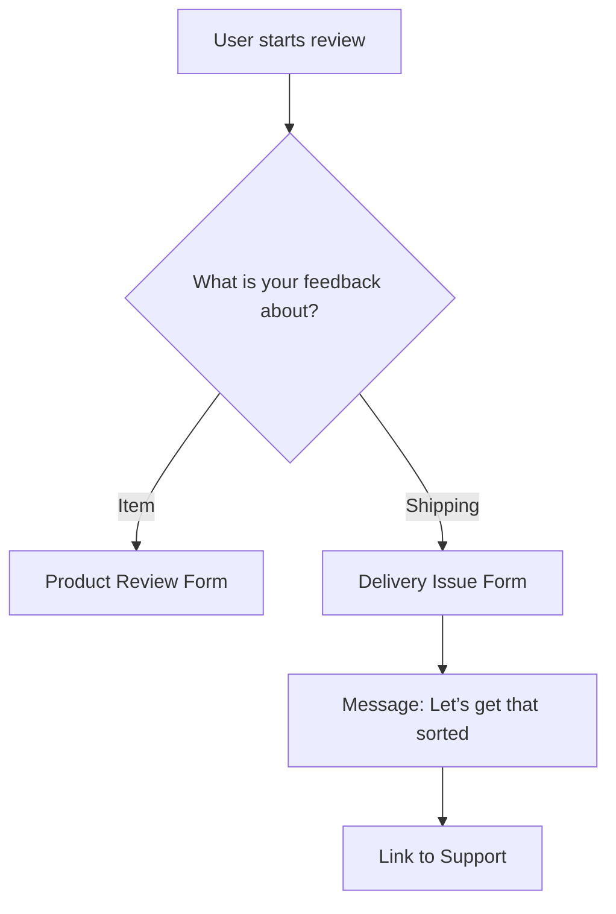

> **Disclaimer:**  
> This article is an independent analysis made for educational and portfolio use. I am not affiliated with Walmart. The opinions here are my own.  
> 
> This content is not sponsored, endorsed, or reviewed by Walmart. Product and brand names are the property of their owners.  
> 
> The goal is to highlight a common user experience issue and suggest a possible solution. It is not to criticize Walmart or its partners.

## Introduction
Many top products on Walmart.com have low ratings. 

This is often not because the products are bad. Instead, customers mix complaints about shipping with product reviews.

This makes it hard to tell which problems are with the product and which are with delivery. It hurts trust and hides real issues.

---

## Case Study Overview
This case study explains a key user experience problem. It proposes a simple fix: a review clarification prompt. This prompt helps separate product feedback from shipping complaints.

The result is clearer ratings, better buyer confidence, and fairer treatment of popular products.

---
## The Problem: Product Ratings Penalized for Shipping Issues
> 75% of sampled 1-star reviews for Angel Soft toilet paper were about shipping, not the product.

Walmart sells both directly and through third-party sellers. This mix means delivery experiences vary.

The review system does not separate product issues from shipping problems.

**Here’s the issue:**

- A customer gets an order late, damaged, has a bad experience, etc.
    
- They leave a 1-star product review.
    
- The product’s rating falls, even though the product itself was fine.
    

**This causes:**

- Unfairly lowered product ratings.
    
- Misleading averages that hide real insights.
    
- Lost sales and eroded trust in Walmart and its sellers.

---
## How Big Is the Problem?

Many 1-star reviews for Walmart’s best sellers complain about shipping, not products.

**Most Reviewed Products Within Some of Walmart’s Top-Selling Categories (Sampling 20 Most Recent Reviews Per Product)**
*(Sources: [Expert Beacon](https://expertbeacon.com/11-most-sold-items-at-walmart/), [Marketing Scoop](https://www.marketingscoop.com/consumer/11-most-sold-items-at-walmaWalmart))*

| Item                                                                                                                                                                               | Category               | Total Ratings | 1-Star Reviews About Shipping  |
| ---------------------------------------------------------------------------------------------------------------------------------------------------------------------------------- | ---------------------- | ------------- | --------------------------------- |
| [Angel Soft Toilet Paper](https://www.walmart.com/ip/Angel-Soft-2-Ply-Toilet-Paper-9-Mega-Rolls/708542578?classType=VARIANT&athbdg=L1100&from=/search)                             | Toilet Paper           | 81.7K         | 15 (75%)                          |
| [7-Quart Slow Cooker](https://www.walmart.com/ip/Crock-Pot-Manual-7-Quart-Slow-Cooker-Black/40703590)                                                                              | Slow Cookers           | 9509          | 9 (45%)                           |
| [32”(720P) LED Smart Television](https://www.walmart.com/ip/onn-32-Class-HD-720P-LED-Roku-Smart-Television-100012589/314022535?classType=REGULAR&from=/search)                     | Televisions            | 54.9K         | 9 (45%)                           |
| [Equate Flushable Wet Wipes](https://www.walmart.com/ip/Equate-Flushable-Wipes-Fresh-Scent-5-packs-of-48-wipes-240-Total-Wipes/873764?classType=VARIANT&athbdg=L1100&from=/search) | Flushable Wipes        | 54.4K         | 13 (65%)                          |
| [Sparkle Paper Towels](https://www.walmart.com/ip/Sparkle-Tear-a-Square-Paper-Towels-6-Double-Rolls/656274757?classType=REGULAR&athbdg=L1100&from=/search)                         | Paper Towels           | 37.8K         | 11 (55%)                          |
| [Mainstays Bed Pillow](https://www.walmart.com/ip/Mainstays-Comfort-Complete-Bed-Pillow-Standard-Queen/744932389?classType=VARIANT&athbdg=L1200&from=/search)                      | Pillows                | 26.4K         | 2 (10%)                           |
| [TAL Stainless Steel Water Bottle](https://www.walmart.com/ip/TAL-Stainless-Steel-Ranger-Water-Bottle-with-Easy-Sip-Straw-26oz-Black/986184222?classType=VARIANT&from=/search)     | Reusable Water Bottles | 5,442         | 5 (25%)                           |

*Data comes from sampling the 20 most recent one-star reviews for each product.*

Up to 75% of negative reviews for popular products are about shipping, not product quality.

---
## What Customers Say (That Should Not Hurt Product Ratings)

Here are examples of real one-star reviews that focus on shipping problems:

---

> “I paid for the 3 Hours or Less for \$5.00 and I didn't get credit for the \$5.00 according to my order which I should have. 5 of my items that I have been trying to get from Walmart for the last 3 deliveries are always out of stock. My order was 45 minutes late being delivered. I have not been happy with Walmart for a couple of months now. Thinking of switching to Amazon or Target.”  
![[Pasted image 20250523113120.png]]

---

> "It has been 48 hours since I ordered my groceries. I am still sitting here. I do not know what the problem is and no one has contacted me so I don't know. I just give him one star for this one."
> 
![[Pasted image 20250523112932.png]]

---

> “The order stated it was here at 3:35 and it's still not here 10 minutes later. so your drivers are stating that the deliveries are delivered when they're not. just a fti. iv been outside for over 15 min thinking it was here, but its not.”
>  
![[Pasted image 20250523112912.png]]

---

> “I am insulted you would even send this. I never received the order or my refund for the order after 2 weeks. Send my refund and you won't have to worry about me ordering anything else from Walmart nor bothering me. Thank you.”
![[Pasted image 20250523112754.png]]

These are real issues with delivery. But they unfairly lower product ratings and mislead buyers.

---
## Why This Matters to Walmart’s Revenue

Even a few shipping-related 1-star reviews can cause big revenue loss.

According to [Gominga](https://gominga.com/insights/online-review-statistics/#:~:text=Reputation%20Management&text=Customers%20are%2021%25%20more%20likely,never%20responded%20to%20their%20review), 96% of dissatisfied customers never leave a review, meaning each negative rating may represent up to 20 unhappy shoppers.

Using conservative estimates:
* If a single product on Walmart.com accumulates 50 such reviews, that could reflect 1,000 negatively affected customers.
* If only 10% of them reduce their annual Walmart spending by 10%
* Based on the average annual spend of $3,578 per shopper ([Business Insider](https://www.businessinsider.com/walmart-typical-customer-demographics-shopper-profile-numerator#:~:text=The%20typical%20customer%20shops%20with,online%20or%20in%2Dapp%20sales)) 
* That still results in a loss of roughly **$35,780** per year from just that one experience voiced from a product review.

This does not count the effect on other customers. Across many products, the impact could be millions of dollars.
### Current Review Flow
At the time of writing, this is the current logic flow for a product review. 
#### Step 1: Product Review Lander
![[msedge_ztWlDjpFp3.png]]
**Above:** Right now, when customers review a product, they first see the star rating. The system assumes feedback is only about the product.
#### Step 2: More Product Review Details
![[YfiJNUuw2g.png]]
**Above:** Next, they enter detailed comments without a chance to say if the issue was with delivery or the item.
### Proposed Solution: Add a Review Routing Step

Add a simple question at the start of the review process:
#### Step 1: Ask What the Review Is About

> **“What would you like to share feedback about?”**

- The item itself
    
- My shipping or delivery experience

![[Frame 1 (1).jpg]]
**Above:** Proposed simple question at the start of the review.
#### Step 2: Route Accordingly

- If the customer picks shipping or delivery:
	- Show a message: 
	  > “We're sorry to hear that. Delivery issues are best handled by Customer Care. Let’s get that sorted.”
	- Provide a link to report the delivery issue or start live chat support.
- If the customer chooses **the item itself**:  
	- Continue with the normal product review form.

#### Review Submission Flowchart

---

### Extra Step: Smart Keyword Detection

Add real-time scanning of review text for shipping-related keywords like "late," "missing," "delivery," or "refund."

If detected, show a gentle message:

> “It looks like you may be reporting a delivery issue. Would you like help with that instead of a product review?”

This helps catch misdirected reviews even if customers miss the first prompt.

#### Product Review Smart Keyword Detection Example

![[879w default (2).jpg]]

**Above:** Example smart keyword detection in action.

---

## Why This Works

- Keeps product ratings accurate by filtering out delivery complaints.
    
- Protects 3rd party sellers (and Walmart brand products) from unfair negative reviews.
    
- Helps customers get support faster by guiding them to the right place.
    
---
## Understanding Walmart’s Complex Fulfillment System

Walmart uses a mix of in-store pickup, local delivery, and shipping. This creates varied customer experiences.

Because of this, the review system needs to clearly separate product feedback from delivery feedback.

Walmart has started adding:

- Product review support flows
    
- Keyword detection in reviews
    
- Clear help links in Order History
    

These steps will reduce wrong reviews and improve delivery problem resolution.

---

## Next Steps for Walmart Stakeholders

- **Pilot the Clarification Prompt**
    
    - Test with 3-5 product categories that get many shipping complaints.
        
    - Measure if the prompt lowers off-topic reviews and improves ratings.
        
- **Track Business Impact**
    
    - Watch sales and conversion rates.
        
    - Survey customers on their review experience.
        
    - Check if delivery support requests increase.
        
- **Gather Feedback**
    
    - Ask Customer Service and sellers about clarity after the change.
        
    - Review tone and relevance of new product reviews.
        
- **Make Improvements**
    
    - Adjust wording and UX based on data and feedback.
        
- **Roll Out to More Categories**
    
    - Expand the solution across Walmart’s web and app platforms.

---
## Summary

Asking customers what their review is about before they write it can fix a big problem.

It improves rating accuracy, builds trust, and helps customers get the right support.

This simple UX change could have a big positive impact on Walmart’s ecommerce success.
